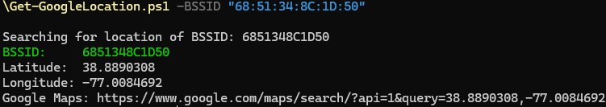

### Overview 
Simple PowerShell script to find the location of a WiFi access point from its BSSID using Google's Location Services. It can also open a Google Maps link to the found coordinates using your default browser.

### Instructions/Usage
To find the location of a bssid run the following: `.\Get-GoogleLocation.ps1 -BSSID "E4:4E:2D:BF:40:6F"`

To find the location and display it on a map, run the following: `.\Get-GoogleLocation.ps1 -BSSID "E4:4E:2D:BF:40:6F" -Map`

To set a specific Android build fingerprint, run the following: `.\Get-GoogleLocation.ps1 -BSSID "E4:4E:2D:BF:40:6F" -DeviceFingerprint "android/google/pixel_5/redfin:11/RQ3A.211001.001/7641976:user/release-keys"`

### Credits
This project is a complement to the project https://github.com/1NobleCyber/Get-AppleLocation.

My interest in this endevour was started with a (now deleted) project by https://github.com/drygdryg, and Erik Rye's Blackhat talk on the subject (https://i.blackhat.com/BH-US-24/Presentations/US24-Rye-Surveilling-the-Masses-with-Wi-Fi-Positioning-Systems-Wednesday.pdf) regarding Apple's Location Services.

### Screenshots

